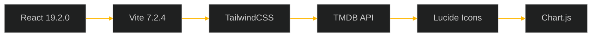

# 📼 CINEHUB

<div align="center">


[](https://sam97300.github.io/Cine-Hub/)
[](https://github.com/Sam97300/Cine-Hub)
[](https://react.dev/)
[](https://vite.dev/)

---

*A nostalgic movie discovery experience with retro VHS aesthetics*

</div>

## 🌟 Overview

CineHub is a vintage-inspired movie discovery platform that brings back the nostalgia of VHS era with modern web technologies. Dive into a universe of cinema through a beautifully crafted interface featuring:

- 🎭 **Trending Movies Stream** - Real-time trending data from TMDB
- 🔍 **Smart Search Autocomplete** - Instant movie discovery
- 📊 **Detailed Analytics** - Movie statistics and insights
- 👤 **Personal Profiles** - Track your watchlist and preferences
- 📼 **Retro VHS UI** - Vintage design with tracking effects and artifacts

## 🚀 Live Experience

> **🔗 [**LIVE DEMO**](https://sam97300.github.io/Cine-Hub/)**
> 
> Experience the full retro VHS movie discovery journey

---

## ✨ Features

### 🎬 **Movie Discovery**
- **Trending Data Stream** - Real-time movie trends with animated loading states
- **Advanced Search** - Intelligent autocomplete with instant results
- **Detailed Views** - Comprehensive movie information including cast, crew, and statistics

### 📼 **Retro VHS Design**
- **Tracking Effects** - Authentic VHS tracking lines and distortion
- **Glass Morphism** - Modern glass panels with backdrop blur
- **Vintage Color Scheme** - Orange accent (#ff4500) with warm highlights
- **Smooth Animations** - Hover effects, transitions, and micro-interactions

### 📱 **Modern Architecture**
- **Progressive Web App** - PWA capabilities with offline support
- **Responsive Design** - Optimized for all devices
- **Performance Optimized** - Built with Vite for lightning-fast loading

---

## 🛠️ Tech Stack



### Core Technologies
- **Frontend**: React 19.2.0 with modern hooks
- **Build Tool**: Vite 7.2.4 for optimal development experience
- **Styling**: TailwindCSS with custom cyberpunk theme
- **API**: TMDB (The Movie Database) for movie data
- **Icons**: Lucide React for consistent iconography
- **Charts**: Chart.js for movie statistics visualization

---

## 🎯 Quick Start

### Prerequisites
- Node.js 18+ 
- npm or yarn

### Installation

```bash
# Clone the repository
git clone https://github.com/Sam97300/Cine-Hub.git
cd Cine-Hub

# Install dependencies
npm install

# Start development server
npm run dev
```

### Available Scripts

```bash
npm run dev      # Start development server
npm run build    # Build for production
npm run preview  # Preview production build
npm run deploy   # Deploy to GitHub Pages
```

---

## 🎨 Design System

### Color Palette
```css
:root {
  --bg: #0b0b0b;        /* Deep black background */
  --panel: rgba(18, 18, 18, 0.6);  /* Glass panels */
  --accent: #ff4500;    /* VHS orange */
  --cyan: #ffb700;      /* Vintage yellow */
  --text: #eaeaea;      /* Light text */
  --muted: #9a9a9a;     /* Muted text */
}
```

### Typography
- **Display**: VT323 (retro terminal font)
- **Body**: Inter (modern, clean sans-serif)

### Effects
- **Tracking Lines**: Authentic VHS tracking effect
- **Grain**: Subtle noise texture
- **Glass Morphism**: Backdrop blur with transparency
- **Hover Animations**: Smooth transitions and transforms

---

## 📸 Screenshots

<div align="center">


</div>

---

## 🔧 Configuration

### Environment Variables
Create a `.env` file in the root directory:

```env
VITE_TMDB_API_KEY=your_tmdb_api_key_here
```

### TMDB API Setup
1. Visit [TMDB](https://www.themoviedb.org/)
2. Create an account and request an API key
3. Add the API key to your environment variables

---

## 🚀 Deployment

### GitHub Pages
The project is configured for automatic deployment to GitHub Pages:

```bash
# Deploy to GitHub Pages
npm run deploy
```

### Manual Deployment
```bash
# Build the project
npm run build

# Deploy the dist folder to your hosting provider
```

---

## 🤝 Contributing

We welcome contributions! Here's how to get started:

1. **Fork** the repository
2. **Create** a feature branch (`git checkout -b feature/amazing-feature`)
3. **Commit** your changes (`git commit -m 'Add amazing feature'`)
4. **Push** to the branch (`git push origin feature/amazing-feature`)
5. **Open** a Pull Request

### Development Guidelines
- Follow the existing code style and patterns
- Ensure all animations are smooth and performant
- Test responsive behavior on multiple devices
- Maintain the retro VHS aesthetic consistency

---

## 📄 License

This project is licensed under the MIT License - see the [LICENSE](LICENSE) file for details.

---

## 🙏 Acknowledgments

- **TMDB** for providing the movie database API
- **React Team** for the amazing framework
- **Vite Team** for the lightning-fast build tool
- **TailwindCSS** for the utility-first CSS framework

---

<div align="center">


[](#-cinehub)

</div>
